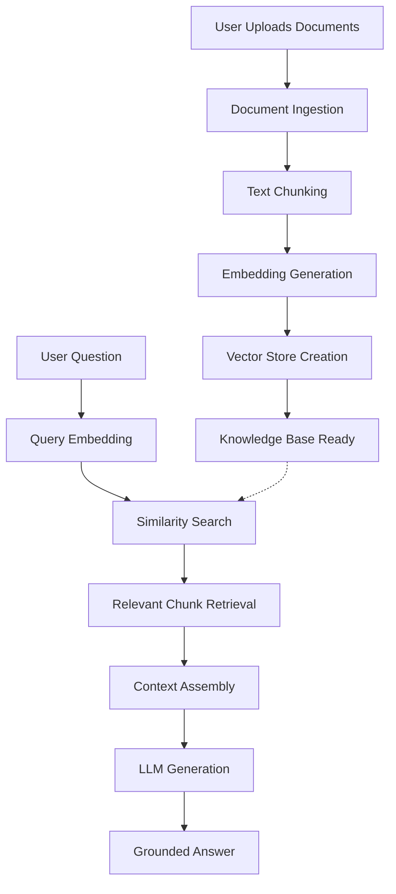

# AI Customer Support Copilot

A professional RAG-based customer support assistant that enables users to upload their own PDF/TXT documents and ask questions based exclusively on those uploaded files. This document-specific support system allows for dynamic knowledge base creation without requiring a fixed company documentation folder.

## 🌟 Project Overview

AI Customer Support Copilot is a sophisticated Retrieval-Augmented Generation (RAG) application that combines modern natural language processing techniques with an intuitive web interface. The system processes uploaded documents, creates vector embeddings, and enables intelligent question-answering grounded strictly in the provided content.

This project demonstrates practical implementation of:
- Document ingestion and processing pipelines
- Vector similarity search using FAISS
- Context-aware LLM responses via LangChain
- Real-time interactive web interface with Streamlit

## 🏗️ Architecture

The application follows a modular architecture with clear separation of concerns:

```
AI-Customer-Support-Copilot/
├── app.py                      # Streamlit web interface
├── main.py                     # Application entry point
├── requirements.txt            # Python dependencies
├── .env.example               # Environment configuration template
├── README.md                  # This file
├── src/                       # Core application modules
│   ├── __init__.py
│   ├── ingestion.py          # Document loading and chunking
│   ├── embeddings.py         # Text embedding generation
│   ├── vectorstore.py        # FAISS vector database management
│   ├── retriever.py          # Similarity search and retrieval
│   ├── prompts.py            # LLM prompt templates
│   ├── llm.py                # Hugging Face LLM integration
│   └── rag_pipeline.py       # End-to-end RAG pipeline orchestration
├── tests/                     # Unit tests
│   ├── __init__.py
│   └── test_document_ingestion.py
└── data/                      # Data directory (legacy, not actively used)
    └── knowledge_base/
```

## 🛠️ Tech Stack

- **Frontend**: Streamlit - Interactive web interface
- **Backend**: Python 3.8+
- **LLM Framework**: LangChain - Orchestration and pipeline management
- **Embeddings**: Hugging Face sentence-transformers
- **Vector Database**: FAISS (Facebook AI Similarity Search)
- **Document Processing**: PyPDF, LangChain document loaders
- **Environment Management**: python-dotenv

## 🚀 Quick Start

### Prerequisites

- Python 3.8 or higher
- pip package manager
- Hugging Face API token ([Get one here](https://huggingface.co/settings/tokens))

### Installation

1. **Clone the repository**
   ```bash
   git clone https://github.com/AnmolCanCodes/AI-Customer-Support-Copilot.git
   cd AI-Customer-Support-Copilot
   ```

2. **Create a virtual environment**
   ```bash
   python -m venv .venv
   source .venv/bin/activate  # On Windows: .venv\Scripts\activate
   ```

3. **Install dependencies**
   ```bash
   pip install -r requirements.txt
   ```

4. **Configure environment variables**
   ```bash
   cp .env.example .env
   ```
   
   Edit the `.env` file and add your Hugging Face token:
   ```env
   HF_TOKEN=your_huggingface_token_here
   ```

5. **Run the application**
   ```bash
   python main.py
   ```

6. **Access the application**
   
   Open your browser and navigate to:
   ```
   http://localhost:8501
   ```

## 📖 Usage Workflow

### Step 1: Upload Documents
- Use the drag-and-drop interface in the sidebar
- Upload one or more PDF or TXT files
- Supported formats: `.pdf`, `.txt`

### Step 2: Build Knowledge Base
- Click "Build knowledge base from uploads"
- The system processes documents through the ingestion pipeline
- Documents are chunked, embedded, and stored in the vector database

### Step 3: Ask Questions
- Type your question in the chat interface
- The system retrieves relevant document chunks
- Answers are generated using only the uploaded content

### Step 4: Manage Session
- Use "Clear chat" to reset conversation history
- Rebuild the knowledge base anytime with new documents

## 🔧 Technical Implementation

### RAG Pipeline Architecture

The application implements a complete RAG pipeline with the following stages:



### Core Components

#### 1. Document Ingestion (`src/ingestion.py`)
- **File Processing**: Handles PDF and TXT file uploads
- **Content Extraction**: Uses PyPDF for PDF parsing, text decoding for TXT files
- **Metadata Management**: Preserves source file information
- **Error Handling**: Graceful handling of encoding issues and malformed files

#### 2. Text Chunking (`src/ingestion.py`)
- **Strategy**: Recursive character text splitting
- **Configuration**: 200-character chunks with no overlap
- **Purpose**: Optimal sizing for embedding and retrieval

#### 3. Embedding Generation (`src/embeddings.py`)
- **Model**: Hugging Face sentence-transformers
- **Output**: Dense vector representations of text chunks
- **Usage**: Enables semantic similarity search

#### 4. Vector Store (`src/vectorstore.py`)
- **Technology**: FAISS (Facebook AI Similarity Search)
- **Function**: Efficient similarity search and clustering
- **Storage**: In-memory vector index for fast retrieval

#### 5. Retrieval System (`src/retriever.py`)
- **Mechanism**: Semantic similarity search
- **Output**: Top-k most relevant document chunks
- **Configuration**: Configurable number of retrieved chunks

#### 6. LLM Integration (`src/llm.py`)
- **Provider**: Hugging Face Inference API
- **Model**: State-of-the-art language model
- **Authentication**: Token-based API access

#### 7. Prompt Engineering (`src/prompts.py`)
- **Template**: Context-aware prompt construction
- **Components**: System instructions, retrieved context, user question
- **Goal**: Ensure responses are grounded in provided documents

#### 8. Pipeline Orchestration (`src/rag_pipeline.py`)
- **Framework**: LangChain RunnablePassthrough
- **Flow**: Question → Retrieval → Context Assembly → LLM → Answer
- **Error Handling**: Validation of API tokens and configuration

## 🧪 Testing

Run the test suite to verify functionality:

```bash
python -m unittest discover -s tests -v
```

Current test coverage includes:
- Document ingestion from uploaded files
- File format validation
- Content extraction accuracy

## 📊 Key Features

- **Dynamic Knowledge Base**: Upload and process documents on-demand
- **Grounded Responses**: Answers strictly based on uploaded content
- **Multi-Document Support**: Process multiple files simultaneously
- **Real-Time Processing**: Immediate vector store creation
- **Interactive Interface**: Intuitive chat-based UI
- **Session Management**: Clear chat history and rebuild knowledge base
- **File Format Support**: PDF and TXT document processing
- **Drag-and-Drop**: Modern file upload experience

## 🔐 Security Considerations

- **API Token Security**: Hugging Face tokens stored in environment variables
- **No Data Persistence**: Uploaded files processed in-memory, not stored permanently
- **Input Validation**: File type and size validation
- **Error Handling**: Graceful degradation on API failures

## 🎯 Use Cases

- **Document Q&A**: Query technical documentation, manuals, or policy documents
- **Research Assistant**: Analyze research papers and extract information
- **Knowledge Base**: Create temporary reference systems from uploaded documents
- **Customer Support**: Build support systems from product documentation
- **Legal Review**: Query legal documents and contracts
- **Educational Tool**: Study and question textbooks or course materials

## 🐛 Troubleshooting

### Application fails to start
- Verify Python version (3.8+ required)
- Ensure all dependencies are installed: `pip install -r requirements.txt`
- Check virtual environment activation

### Questions not being answered
- Confirm `.env` file exists with valid `HF_TOKEN`
- Verify Hugging Face token has appropriate permissions
- Check internet connectivity for API access

### File upload issues
- Ensure files are valid PDF or TXT format
- Check file size (very large files may timeout)
- Verify file encoding for TXT files (UTF-8 recommended)

### Vector store errors
- Rebuild knowledge base after uploading new files
- Check memory availability for large document sets
- Verify document content is not empty

## 🔄 Development Workflow

### Adding New Features

1. Identify the appropriate module in `src/`
2. Follow existing code patterns and conventions
3. Add corresponding tests in `tests/`
4. Update documentation if behavior changes

### Testing Changes

```bash
# Run specific test
python -m unittest tests.test_document_ingestion -v

# Run all tests
python -m unittest discover -s tests -v
```

### Code Style

- Follow PEP 8 guidelines
- Use descriptive variable and function names
- Add docstrings for new functions
- Maintain existing code structure

## 📈 Performance Considerations

- **Chunk Size**: Current 200-character chunks balance retrieval accuracy and performance
- **Vector Store**: In-memory FAISS provides fast retrieval for moderate document sets
- **API Latency**: Response time depends on Hugging Face API performance
- **File Processing**: Large PDFs may take longer to process

## 🤝 Contributing

Contributions are welcome! Please follow these guidelines:

1. Fork the repository
2. Create a feature branch
3. Make your changes with appropriate tests
4. Ensure all tests pass
5. Submit a pull request with clear description

## 📝 License

This project is provided as-is for educational and commercial use. Please ensure compliance with:
- Hugging Face model licenses
- FAISS license terms
- LangChain license requirements
- Any applicable data privacy regulations

## 🙏 Acknowledgments

- **LangChain**: For the powerful orchestration framework
- **Hugging Face**: For embedding models and LLM access
- **FAISS**: For efficient similarity search
- **Streamlit**: For the intuitive web interface


---

**Built with ❤️ using modern RAG techniques and best practices**
